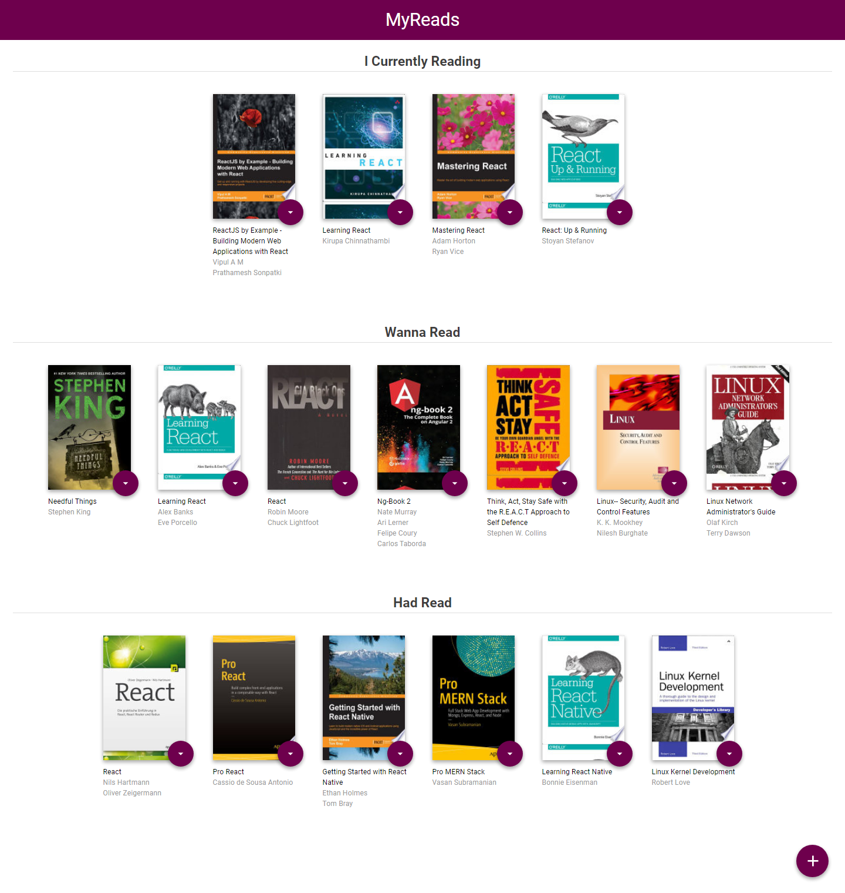
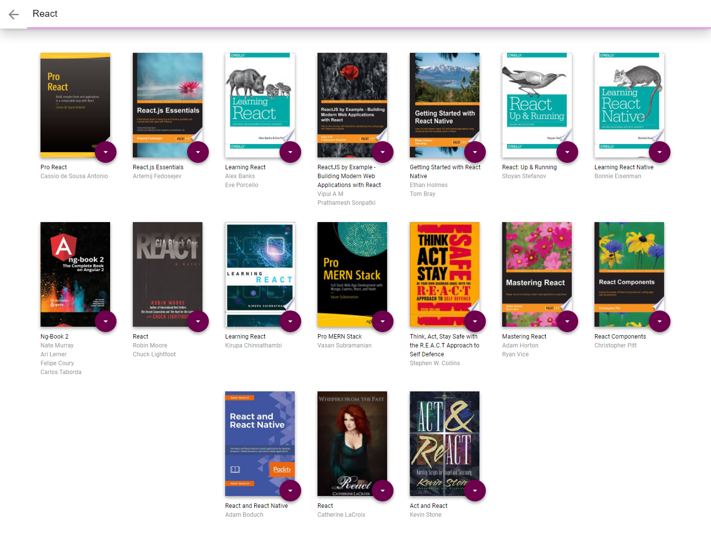

# MyReads

MyReads is a simple cataloging app that allows you to place books in one of three shelves or categories.

- Currently Reading
- Want to Read
- Read

It's allow you to search for books

This app is the second project of Udacity Nano Degree and FWD Egypt Scholarship

You can see [screenshots](#screenshots) below.

## Installation

Clone the repository, change directories, and use NPM to install the dependencies.

```bash
$ git clone https://github.com/Monayaty/My-Reads.git
$ cd My-Reads
$ npm install
```

## Usage

The project can be run with

- `npm start`

The project can be viewed in the browser at

- [http://localhost:3000](http://localhost:3000)

## Screenshots


